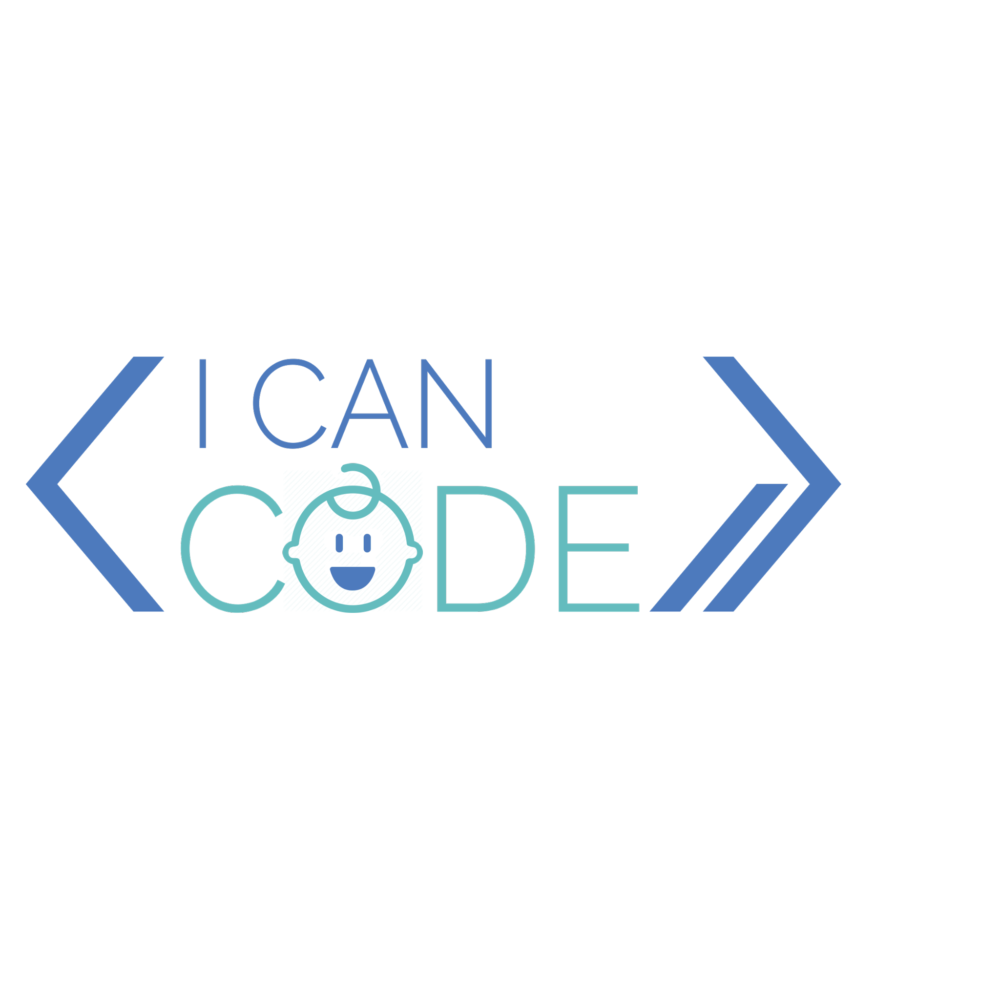

# Coding for Kids

## Description
The purpose of this online environment is to teach children coding skills.  In this platform children can share ideas and help each other while learning coding. 

## Table of contents
- Features
- Usage
- Team members
- Project status

## Features
- My room
- Courses 
- Community
- Tutorials
- Live classroom

## Usage

- After signing up/logging in the user is taken to the **dashboard**, where there is a visual overview of everything involving the user (participation in courses, ongoing projects). In **my room** it is possible to see progress in courses, goals. 
- In **courses** page user can find relevant courses by using the search function and join them. 
- In **my community** page it is possible to browse other people's problems, send questions via form, and see your own connections. 
- **Tutorials** page shows recent tutorials watched and videos by the community. 
- **Live classroom** page allows the user to join someone for a live class. 

## Team members
- Mari-Anna  <mari333@tlu.ee>
- Ziquian  <ziqian@tlu.ee>
- Silvia  <s1lv1a@tlu.ee>
- Kelly  <kelly9@tlu.ee>

## Project status
Prototype has the UI finished at an acceptable level considering the time and skills constraints. As for functionalities, we have page navigation, carousel, forms, modals, collapsibles, which means that the website has some level of interactivity. In the future, the following features were considered to be added: Chatbot, AI teacher, possible widening of the courses domain (adding languages), Multiplayer / single player games, etc.
